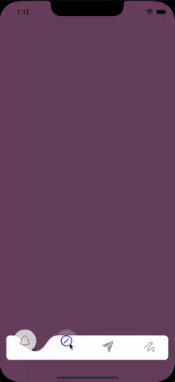

# Description

Include a full implementation of an animated TabBar components.

This components is based in a Kavsoft channel video that develop this same component but using SwiftUI. I recommend that you could check this video [here :)](https://www.youtube.com/watch?v=Lw-vimpu6Cs&ab_channel=Kavsoft).

# Result

You could see the result in the following gif:



# How to use 

```swift
import UIKit
import Combine

class ViewController: UIViewController {

    @IBOutlet private weak var tabBar: BubbleTabBar!
    
    private var cancellables: Set<AnyCancellable> = Set()
    private let colors: [UIColor] = [.brown, .blue, .black, .green]
    
    override func viewDidLoad() {
        super.viewDidLoad()
        
        // Create the view models to display
        let tabs: [BubbleTabBar.Tab] = [
            BubbleTabBar.Tab(id: "1", tint: colors[0], content: .image(uimage: .init(systemName: "bell")!)),
            BubbleTabBar.Tab(id: "2", tint: colors[1], content: .image(uimage: .init(systemName: "pencil.circle")!)),
            BubbleTabBar.Tab(id: "3", tint: colors[2], content: .image(uimage: .init(systemName: "paperplane.fill")!)),
            BubbleTabBar.Tab(id: "4", tint: colors[3], content: .image(uimage: .init(systemName: "scribble")!)),
        ]
        
        // Order the display of the tabs
        tabBar.show(tabs: tabs)
        
        // Listen tabs changes events (using Combine)
        tabBar.didSelectTab.sink { event in
            switch event {
            case let .didSelect(index):
                // Send when the animations ends
                self.view.backgroundColor = self.colors[index]
            case let .willSelect(index):
                // Send when the animation starts
                UIView.animate(withDuration: 0.3) {
                    self.view.backgroundColor = self.colors[index]
                }
            }
        }
        .store(in: &cancellables)
    }
}
```

Additionally you have another public methods like:

```swift
    /**
     Select the given tab
     - parameter tab: The tab to be displayed
     - parameter animated: Define if the selection will be animated or not
     - note: If no tab will be found with the given tab id, this method do nothing
     */
    func select(_ tab: Tab, animated: Bool = true)

    /**
     Select the tab located at the given index
     - parameter index: The index to be displayed
     - parameter animated: Define if the selection will be animated or not
     - note: If no tab will be found with the given index, this method do nothing
     */
    func select(_ index: Int, animated: Bool = true)
```